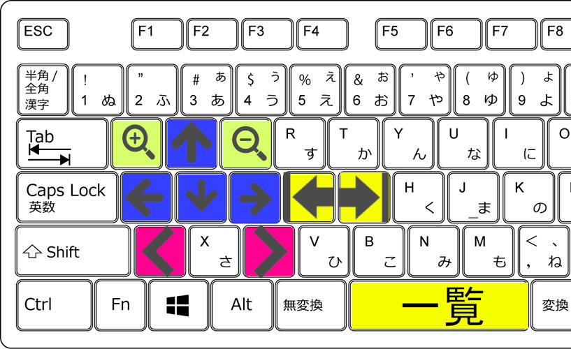

<h1 align="center">紙面ビューアー・改</h1>

「紙面ビューアー・改」は、日経新聞の紙面ビューアーを使いやすくするGoogle Chromeの拡張機能（非公式）です。日経新聞の紙面をみるには有料契約が必要です。

### 主な機能
- キーボードによる紙面操作ができます
- 拡張機能アイコンから直接、日経新聞の紙面を起動できます

### 前提条件
- Google Chromeでの閲覧
- 日経新聞電子版の有料契約

### インストール方法
1. Google Chromeを起動する
1. このレポジトリを [ZIPファイルとしてダウンロード](https://github.com/shiosanma/NPaperViewMod/archive/refs/heads/master.zip)する
1. 解凍すると `NPaperViewMod-master`というフォルダがでてくるので、好きな場所に移動する
1. 拡張機能のページ（`chrome://extensions`）を開く
1. ブラウザのデベロッパーモードを有効にする
1. `NPaperViewMod-master`のフォルダをドラック＆ドロップする
1. `NPaperViewMod-master`のフォルダは **「削除しない」でください**

*Microsoft Edgeとも互換性はありですが、動作確認はしていません*

### 使い方
日経紙面ビューアーを起動すると自動的に使えます。「右手でマウス、左手でキーボード」を使うと操作しやすいです。

#### 紙面ビューアーの起動
拡張機能のアイコンをクリックすると、紙面ビューアーへのリンクが表示されます。

#### キーボード操作

デフォルトでは、下記のとおりキーは割り当ててあります。キーの変更は `scripts/shortcuts.js` を直接いじってください。

| キー | 対応する動作 |
| --- | --- |
| W | 上に移動 |
| A | 左に移動 |
| S | 下に移動 |
| D | 右に移動 |
| Q | 紙面の拡大 |
| E | 紙面の縮小 |
| Z | １つ左にある紙面に移動 |
| C | １つ右にある紙面に移動 |
| F | 一番左端の面へ移動（最終面） |
| G | 一番右端の面へ移動（１面） |
| Space | 紙面の一覧を表示 |

### その他
日経新聞のPC用紙面ビューアーは、マウスのホイール拡大縮小の反応が悪く、各ボタンも小さいです。快適に閲覧できるよう、操作にショートカットを使える拡張機能を作りました。

問い合わせは、[Twitter](https://www.twitter.com/shiosanma)までお願いします。
